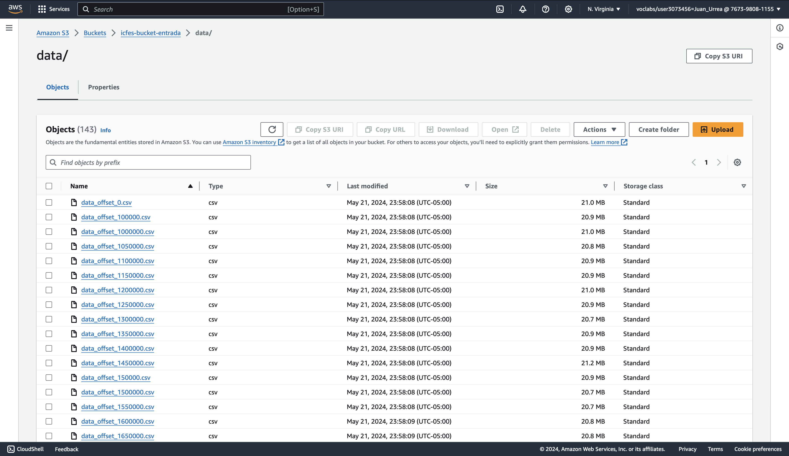
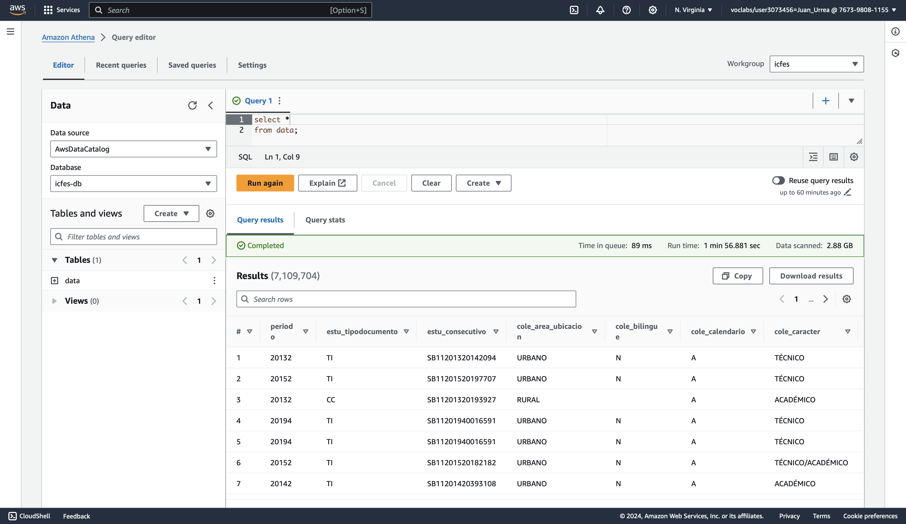
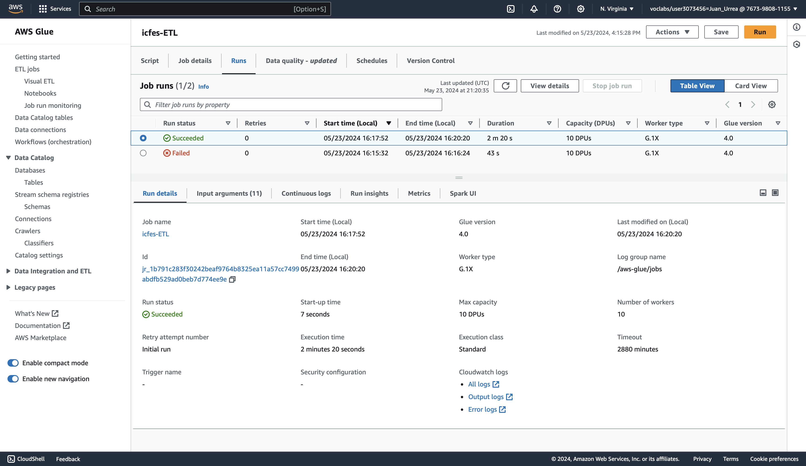

# Configuración de S3 + Glue + Athena en AWS

## Crear buckets en S3

1. Crear un bucket que sirva para los datos de entrada del proceso ELT (Data Lake).
2. Crear una carpeta en el bucket de entrada llamada `data/`.
3. Crear un bucket que sirva para almacenar los resultados de las consultas ETL.

## Crear una tabla en Glue

1. Crear un workgroup llamado `icfes-workgroup` utilizando Athena SQL y el bucket de salida creado.
2. Crear una DataSource utilizando S3 Glue Data Catalog y asociar un nuevo Crawler.
3. Crear un Crawler llamado `icfes-crawler` que apunte a la carpeta `data/` del bucket de entrada.
4. Crear Database llamada `icfes-db` y asociar el Crawler creado.
5. Obtenga los datos siguiendo las instrucciones de la sección "Obtener los datos".
6. Ejecute el Crawler On-Demand y verifique que la tabla fue creada en la base de datos `icfes-db`.

## Obtener los datos

1. Usar el script `download_chunks.py` para descargar los datos paginados desde el API de `datos.gov.co`.
2. Manualmente subir todos los archivos CSV generados al bucket de entrada de S3.

## Crear una consulta en Athena

1. Seleccionar el workgroup `icfes-workgroup` y la base de datos `icfes-db`.
2. Crear una nueva consulta SQL para obtener los datos de la tabla creada en Glue.
3. Ejecutar la consulta y verificar que los resultados son correctos.

Athena se puede usar como una primera aproximación para explorar los datos. Por ejemplo, se puede usar para verificar la consistencia de los datos, sus rangos de valores, sus tipos de datos y la cantidad de valores nulos. Usamos esta herramienta como base para definir el preprocesamiento de datos explicado en la siguiente sección.

## Crear un ETL Job en Glue

1. Crear un nuevo Job de tipo Spark en Glue.
2. Asociar el Job con la base de datos `icfes-db` y la tabla creada en Glue.
3. Crear un nuevo script de Spark en Python que realice el proceso de transformación de los datos (`icfes-ETL.py`).
4. Ejecutar el Job y verificar que los resultados son correctos. Después, exportar los datos desde Athena.

