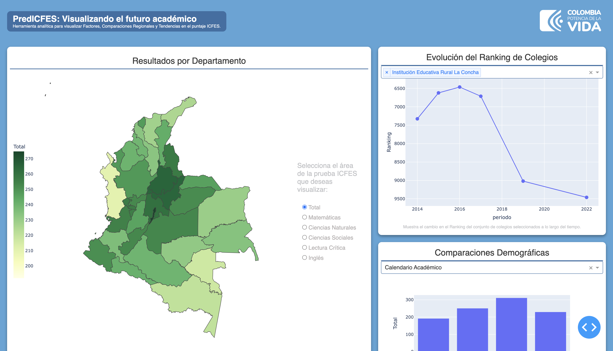
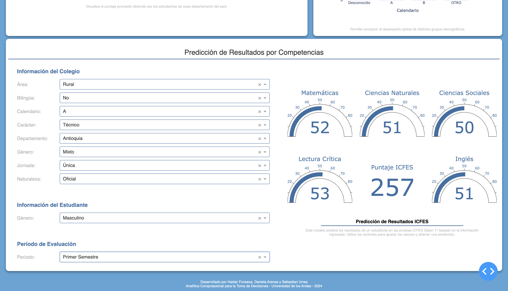

# PredICFES

PredICFES es una completa herramienta analítica diseñada para visualizar los factores, comparaciones regionales y tendencias en el puntaje del ICFES (Instituto Colombiano para la Evaluación de la Educación). Esta herramienta proporciona una amplia gama de funcionalidades que ayudan a comprender mejor el desempeño educativo en Colombia y a tomar decisiones informadas para mejorar la calidad educativa en el país.

## Instalación

1. Clona este repositorio en una instancia EC2 de AWS.
2. Construye la imagen utilizando el `Dockerfile` suministrado.
3. Ejecuta la imagen en el puerto apropiado, configura las reglas de seguridad y verifica el funcionamiento.

## Estructura de Directorios

- Business Analysis: Documentos relacionados con el análisis de negocio.
- Business Context: Información contextual sobre el negocio y la industria.
- Dashboard: Código fuente para el panel de visualización.
- Data Analysis: Archivos y scripts relacionados con el análisis de datos.
- Data Engineering: Scripts para la ingeniería y limpieza de datos.
- Data Science: Modelos de machine learning y análisis predictivo.
- Despliegue: Archivos finales usados en el despliegue de la aplicación.
- DevOps: Configuración y scripts de despliegue.
- Results: Resultados y conclusiones obtenidas del análisis.

### Entregables

- Reporte de trabajo en equipo: Disponible en el archivo `Results/teamwork.md`.
- Tarea 1: Las preguntas de negocio y el plan de acción se encuentran en `Business Analysis/action_plan.md`.
- Tarea 2/Soporte 1: La limpieza de datos, el alistamiento de los mismos y los datos finales se encuentran en `Data Engineering/`.
- Tarea 3/Soporte 2: La exploración de datos se encuentra en los cuadernos Jupyter disponibles en `Data Analysis/`.
- Tarea 4/Soporte 3: Los modelos de predicción explorados se encuentran en los cuadernos Jupyter disponibles en `Data Science/`.
- Tarea 5/Soporte 4: Los archivos fuentes del tablero y sus _assets_ respectivos se encuentran disponibles en `Dashboard/`.
- Tarea 6/Soporte 5: Snapshots de las máquinas lanzadas y archivos de configuración se encuentran disponibles en `DevOps/`.
- Archivos de Despliegue/Soporte 5: Modelos serializados, archivos _environment_ y versión final del tablero se encuentran en `Despliegue/`.
- Repositorio Git/Soporte 6: Disponible en la dirección URL: [https://github.com/HaiderFonseca/ICFES](https://github.com/HaiderFonseca/ICFES).
- Tablero desplegado: Disponible en la dirección URL: [http://52.54.224.49/](http://52.54.224.49/).

## Funcionalidades

- Identificar a través de un mapa los departamentos con mejores y peores desempeños.
- Hacer un seguimiento al _ranking_ nacional obtenido por los colegios colombianos.
- Visualizar el desempeño promedio de diversos grupos demográficos en las pruebas de estado.
- Predecir el puntaje obtenido por un estudiante en las distintas competencias y de manera global en el examen ICFES Saber 11.

## Autores

- Daniela Arenas - k.arenas@uniandes.edu.co
- Haider Fonseca - h.fonseca@uniandes.edu.co
- Sebastian Urrea - js.urrea@uniandes.edu.co

## Licencia

Este proyecto está bajo la Licencia MIT - ver el archivo [LICENSE](LICENSE) para más detalles.
